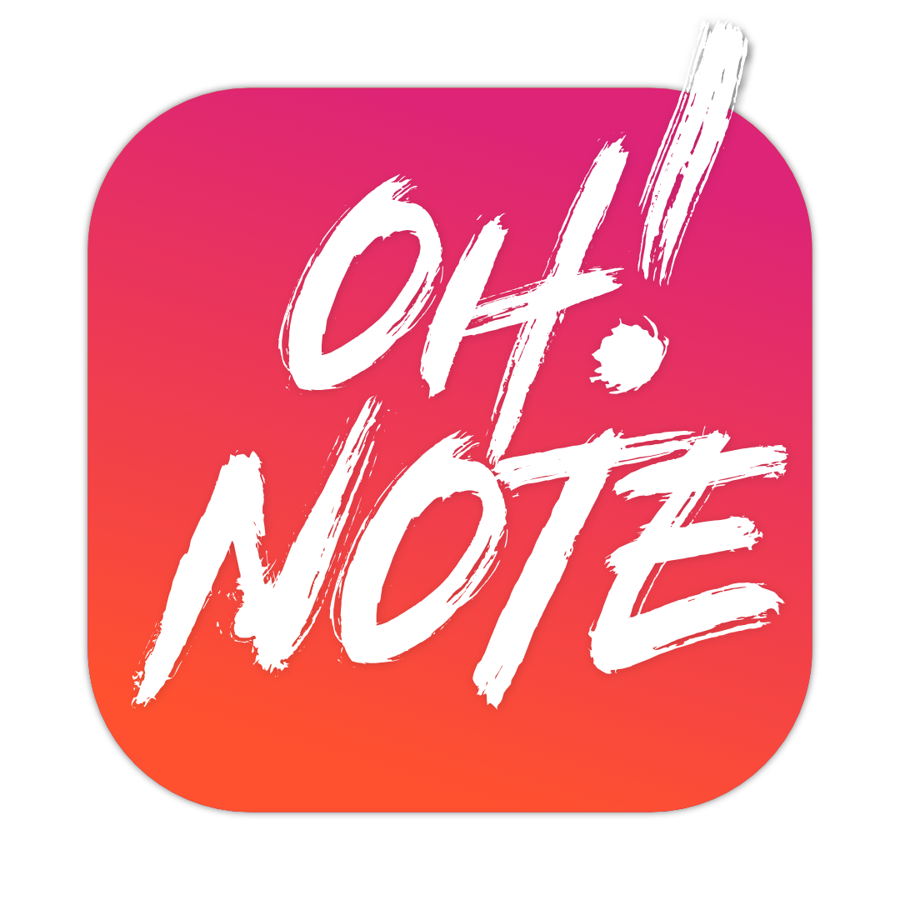

# OhNote! ✨✏️

Welcome to the official download page for Oh!Note App.

Elevate your presentations and brainstorming sessions with **OhNote!** — the ultimate on-screen annotation tool that brings your ideas to life. Whether you're highlighting key points or sketching out concepts, OhNote! lets you draw directly over your screen in real-time.

### 💾 👉 [Download Latest Release](https://github.com/mcmxcii-ldn/oh-note-releases/releases/latest) 👈

## 🚀 Features

- **Free Drawing Tool**: Unleash your creativity with smooth, freehand drawing.
- **Shape Tools**: Add rectangles, circles, and arrows to emphasize important areas.
- **Color Palette**: Choose from vibrant colors like yellow, red, and blue to make your annotations pop.
- **Brush Sizes**: Select from small, medium, or large brush sizes to suit your needs.
- **Disappearing Ink Mode**: Keep your screen clutter-free with annotations that fade away after a short while.
- **Layout Toggle**: Switch between horizontal and vertical toolbar layouts for your convenience.
- **Reset Canvas**: Clear all annotations instantly to start fresh.
- **Always On Top**: OhNote! stays above all other windows, so you can annotate anytime.
- **Global Shortcut**: Quickly show or hide OhNote! with `Command + Control + A`.

## 🏁 Getting Started

For more information or to report an issue, please visit our [Issues page](https://github.com/mcmxcii-ldn/oh-note-releases/issues).

### 🎬 Launching the App

OhNote! runs in fullscreen mode to give you complete freedom over your workspace. To start annotating, simply launch the app, and you're good to go!

### 🚪 Exiting OhNote!

When you're ready to continue with your work or presentation without annotations:

- Press `Command + Control + A`, or
- Press `Esc`, or
- Press `Command + W` while OhNote! is active.

### 🛠 Using the Toolbar

- **Select Tools**: Click on the toolbar icons to switch between drawing tools like freehand, rectangle, circle, or arrow.
- **Choose Colors**: Pick your preferred color from the color options.
- **Adjust Brush Size**: Select the brush size that fits your annotation style.
- **Disappearing Ink**: Toggle the disappearing ink mode to have your annotations fade away.
- **Layout Toggle**: Switch the toolbar between horizontal and vertical layouts to suit your workflow.
- **Clear Canvas**: Click the reset icon to clear all current annotations.

## 💡 Tips & Tricks

- **Undo/Redo**: Use `Ctrl + Z` and `Ctrl + Y` (or `Command` on Mac) to undo or redo your last action when the disappearing ink mode is off.
- **Stay Organized**: Use shapes and colors to categorize your annotations for better clarity.
- **Flexible Toolbar**: Drag the toolbar to any position on your screen for optimal accessibility.

---

## 📚 Documentation

### 📺 Fullscreen Mode

OhNote! operates in fullscreen mode to ensure maximum screen real estate for your annotations. This mode provides an unobstructed workspace, perfect for both presentations and personal brainstorming sessions.

### 🔄 Exiting Fullscreen

To exit fullscreen mode and return to your regular workflow, use one of the following shortcuts:

- **Global Shortcut**: Press `Command + Control + A`.
- **Escape Key**: Press `Esc`.
- **Close Command**: Press `Command + W` while OhNote! is active.

### 🖌 Additional Functions

- **Toolbar Positioning**: The toolbar can be dragged to any corner of the screen, allowing you to place it where it's most convenient for you.
- **Disappearing Ink**: Toggle this feature to automatically fade out your annotations, keeping your screen clean and clutter-free.
- **Shape Customization**: Easily switch between different shapes and adjust their properties to fit your annotation needs.
- **Color and Brush Adjustments**: Customize your annotations with a variety of colors and brush sizes to make your notes stand out.

# License
This software is proprietary and owned by mcmxcii. All rights reserved. No part of this codebase or any of its contents may be reproduced, copied, modified, or adapted without the prior written consent of the author.

Copyright © 2024 mcmxcii. All rights reserved.
